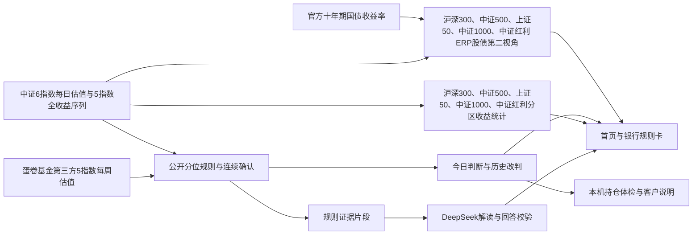

# 《经纬·规则e判——基于公开估值规则与大模型解读的指数基金决策服务方案》

**参赛方向：财富管理服务**
**作品：经纬·规则e判｜当前实现：1.0.0-rc.5、规则v2｜资料核对日期：2026-10-07**

## 第一部分：摘要／项目概要

基金客户关心三个问题：新钱怎么安排，手里的基金怎么看，什么变化会让判断改变。经纬用中证官方每日估值、蛋卷基金第三方每周估值、公开分区规则和大模型解读，提供从市场判断到持仓理解、再到客户经理沟通的财富管理服务。

**先看历史证据：按现行规则（v2），沪深300处于偏低、中间、偏高、高位区后，持有三年的年化收益均值依次为 9.6%、6.3%、3.7%、−5.1%。** 上证50为 9.0%、6.3%、3.3%、−5.5%；中证500前三档为 6.2%、−1.4%、−5.6%，高位区尚无完整样本。五个指数各换十组参数，50 次中有样本区间的三年年化均值排序在 49 次成立；仅 18 次四档齐全，其中 17 次完整排序成立。中证1000缺偏高、高位区样本，中证红利缺高位区样本，不能声称它们四档完整排序成立（月初取样，见《规则稳健性》）。数据为中证含分红全收益指数，按当天已确认区间统计。[1]

**再看判断能否核查：沪深300、中证500、上证50十年里分别改判 17、9、22 次，每一次都能用公开数据独立复算。** v2 在离开已确认区间时加了 5 个百分点的缓冲：同样的数据，不加缓冲时改判 31、17、42 次，其中 7、7、18 次在 45 天内又改了回去；加缓冲后只有 1、0、2 次。规则判别给出新钱与持仓的不同说法，大模型负责解释原因与条件。“问经纬”已有 DeepSeek 真实调用记录，读者可以展开所引原文，程序检查引用、数字和立场。[2][3]

产品已具备 11 个指数切换、历史曲线回看、分区收益统计、股债性价比对照、持仓导入与体检、问经纬、可嵌入规则卡和客户经理一页说明；分区收益统计和股债性价比对照覆盖沪深300、中证500、上证50、中证1000、中证红利五个指数。目标用户是开始长期配置或需要复核基金持仓的个人客户，以及承担投教、持有期回访的银行客户经理。银行可从基金频道的规则卡和线下说明页开展试点，先检验客户理解与服务效率。

关键词：财富管理服务；公开估值规则；指数基金；大模型解读；持仓体检。

## 第二部分：引言与背景分析

### 2.1 选题背景与核心问题

基金信息很多，客户却常常难以把估值、历史表现和自己的持仓放在一起理解。看到“估值适中”，仍会追问已有定投是否继续、闲钱是否追加；买了不同名称的基金，也可能重复配置同一个指数。银行客户经理则需要不断解释判断依据、适用情境和变化条件。

经纬解决的是这条沟通链：**当前估值位置 → 公开规则的判断 → 对持仓和计划的含义 → 何时改变 → 依据在哪里。** 把结论与条件放在同一页，有助于客户形成可以复述、可以核查的长期配置认识，也使线上查看与线下说明采用同一口径。

### 2.2 国内外应用现状与项目定位

国内已有且慢长赢计划的组合与投资陪伴服务、蛋卷估值的指数数据工具、有知有行温度计的市场观察与历史统计。它们分别回应组合执行、估值查询和周期理解等需求。海外财富管理应用也普遍结合账户整理、配置展示和客户沟通；本项目以A股及美股港股指数和国内银行基金服务为具体落点。

经纬选择公开、可按各指数数据频率复算的 PE 分位规则，配合有引用的大模型问答，再把相同结果用于持仓体检和银行说明。市场判断、个人账户理解与渠道交付围绕同一份规则数据组织。第五部分列出具名竞品对比。[6—8]

### 2.3 应用价值与社会意义

对个人客户，价值是看懂新钱与持仓分别对应什么含义，发现重复配置，知道下一次改变的条件。对银行，价值是减少客户经理重复整理材料，让基金投教和持有期回访有统一、可更新的依据。项目用明确的规则与来源支持金融知识普及，并把服务效率、客户理解作为首阶段可观察的成果。

## 第三部分：作品介绍（详细方案）

### 3.1 产品概述与最强证据

经纬覆盖 11 个指数：A股为沪深300、中证500、上证50、中证1000、创业板指、科创50、中证红利；美股港股为纳斯达克100、标普500、恒生指数、恒生科技。首页先展示估值位置和新钱、持仓两个判断，拖动曲线可以回看历史日期；从首页“…的 N 次改判 →”进入 `/changes` 判断变化页，页顶“‹ 今日判断”返回首页；该页展示每次改变，沪深300、中证500、上证50、中证1000、中证红利五个指数另有该区间之后的历史收益和股债对照（ERP），科创50、创业板指和四个境外指数只给估值判断和改判记录。

下表为沪深300、中证500、上证50现行规则（v2）的接口统计 `GET /publication/rule-outcomes`，采用中证含分红全收益指数，数据截至 **2026-09-30**。每格依次列“**三年年化均值／样本起始日数**”；样本日数是具备完整持有期的起始日数量。[1]

| 现行v2：三年年化均值／样本起始日数 | 偏低区 | 中间区 | 偏高区 | 高位区 |
|---|---:|---:|---:|---:|
| 沪深300 | **9.6%／163** | **6.3%／856** | **3.7%／508** | **−5.1%／244** |
| 上证50 | 9.0%／59 | 6.3%／854 | 3.3%／654 | −5.5%／204 |
| 中证500 | 6.2%／1,115 | −1.4%／500 | −5.6%／156 | 无完整样本／0 |

沪深300v2的三年中位数为 **9.4%、5.5%、7.3%、−7.9%**，正收益比例为 **100.0%、86.7%、70.7%、16.8%**；一年均值为 **7.0%、14.2%、−1.8%、−4.8%**。沪深300与上证50的三年均值从偏低到高位依次降低，中证500前三档同样依次降低。五指数的参数敏感性（十组参数、月初取样）见《规则稳健性》：五个指数各换十组参数，50 次中有样本区间的三年年化均值排序在 49 次成立；仅 18 次四档齐全，其中 17 次完整排序成立。中证1000缺偏高、高位区样本，中证红利缺高位区样本，不能声称它们四档完整排序成立；唯一排序例外是上证50改用 7 年窗口时偏高区高于中间区。

### 3.2 公开规则与当前判断

分位计算取截至当天、含当天的近十年 PE TTM 数据，计算“估值不高于当日”的数据读数比例；历史不足十年时使用已有数据，至少积累五年才开始计算。科创50、恒生科技的历史不足十年，按已有数据计算，页面标注“不足十年”。分档使用未舍入分位，显示值保留一位小数。

| 分位区间 | 确认区域 | 新增资金 | 已有持仓 |
|---|---|---|---|
| 低于 30% | 偏低区 | 可分批新增 | 继续持有 |
| 30% 至不足 70% | 中间区 | 按原计划，不额外追加 | 继续持有 |
| 70% 至不足 90% | 偏高区 | 暂缓新增 | 继续持有 |
| 达到 90% | 高位区 | 暂停新增 | 可按计划再平衡 |

**v2离开已确认区间时，在该区间边界外增加5个百分点缓冲；中证每日数据需连续5个交易日确认，蛋卷每周数据需连续2个周读数确认，两者都约等于一周。** 从中间区进入偏低需低于第25百分位，进入偏高需达到第75百分位；进入高位的当前参考仍为第90百分位。 回到原区间或进入另一个候选区间，连续确认重新计算；首日建立初始区域，之后按对应数据频率确认。

当前判断如下，数值以[指数覆盖](指数覆盖.md)为准，均截至 **2026-09-30**：[2]

| 指数 | PE TTM | 百分位 | 已确认区域 | 新增资金 | 持仓 | v2改判次数／v1对照 |
|---|---:|---:|---|---|---|---:|
| 沪深300 | 13.15 倍 | 48.8 | 中间区 | 按原计划，不额外追加 | 继续持有 | 17／31 |
| 中证500 | 25.09 倍 | 71.6 | 偏高区 | 暂缓新增 | 继续持有 | 9／17 |
| 上证50 | 10.95 倍 | 61.2 | 中间区 | 按原计划，不额外追加 | 继续持有 | 22／42 |
| 中证1000 | 29.59 倍 | 66.3 | 偏高区 | 暂缓新增 | 继续持有 | 6／14 |
| 创业板指 | 35.83 倍 | 28.3 | 中间区 | 按原计划，不额外追加 | 继续持有 | 3／10 |
| 科创50 | 71.37 倍 | 68.6 | 偏高区 | 暂缓新增 | 继续持有 | 3／9 |
| 中证红利 | 8.6 倍 | 75.6 | 偏高区 | 暂缓新增 | 继续持有 | 17／27 |
| 纳斯达克100 | 30.95 倍 | 49.4 | 中间区 | 按原计划，不额外追加 | 继续持有 | 14／21 |
| 标普500 | 25.14 倍 | 54.8 | 中间区 | 按原计划，不额外追加 | 继续持有 | 8／8 |
| 恒生指数 | 10.9 倍 | 57.4 | 中间区 | 按原计划，不额外追加 | 继续持有 | 8／14 |
| 恒生科技 | 22.57 倍 | 29.4 | 中间区 | 按原计划，不额外追加 | 继续持有 | 3／7 |

中证1000、科创50的分位低于70仍是偏高区，创业板指、恒生科技低于30仍是中间区：缓冲要求越过65或25才离开当前区间。缓冲在10个指数上减少了改判和快速反转；标普500例外，改判次数相同，45天内反转由0变为1。

沪深300当前参考 PE 边界为 **12.22／14.41／15.33 倍**，对应当前已确认中间区下的缓冲改判条件。v1未加缓冲时的参考值为 **12.42／14.24／15.33倍**。边界随滚动窗口更新，正式判据是每天分位与连续确认。最近一次改判为 **2026-09-07，偏高区转中间区**；当日 PE **13.64 倍**、第 **58.1 百分位**，新钱说法从“暂缓新增”转为“按原计划，不额外追加”。

独立复算脚本只共享原始估值序列，另写窗口、分位和连续确认算法，不调用生产规则函数。11 个指数均可独立复算，测试逐条核对改判记录与软件一致，例如 `node scripts/replay-rule.ts --index NDX`；首次建立区域单列，不计入改判次数。沪深300、中证500、上证50的v1无缓冲复算为31／17／42次，v2为17／9／22次。[2]

### 3.2.1 股债性价比：已实现的第二视角

“判断变化”页对沪深300、中证500、上证50、中证1000、中证红利五个指数另设股债性价比对照，下表保留原三指数结果：**ERP＝盈利收益率（1／PE）−十年期国债到期收益率**。采用中证PE和财政部—中国国债收益率曲线的同日记录，不插值；ERP分位也看近十年、不足时至少五年起算。当前软件 `GET /publication/erp` 的数据截至2026-09-30。[13]

| 指数 | 十年期国债收益率 | ERP | ERP百分位 | PE规则／ERP对照 |
|---|---:|---:|---:|---|
| 沪深300 | 1.68% | 5.92% | 80.7 | 中间区／ERP高位 |
| 中证500 | 1.68% | 2.31% | 56.2 | 偏高区／ERP中间 |
| 上证50 | 1.68% | 7.45% | 77.8 | 中间区／ERP高位 |

ERP分组为第70百分位及以上“高位”、30至不足70“中间”、10至不足30“偏低”、不足10“低位”。沪深300历史上PE偏低区对应ERP高位的一致率为 **98.3%（344／350个对照日）**；四档全部对照的一致率为 **57.4%（1,432／2,495日）**。ERP从高到低四组后三年年化均值为 **9.4%、4.2%、2.4%、0.6%**，样本起始日数为 **316、805、490、157**。

当前沪深300PE规则为中间区，ERP却在高位，原因是两者比较对象不同：PE看股票相对自身历史的位置，ERP看股票相对国债的盈利收益率差。当前盈利收益率 **7.60%**，减去国债 **1.68%**，得到ERP约 **5.92%**。低国债收益率可使股票相对债券更有吸引力。页面保留这一分歧，**ERP只作第二视角，不执行五日确认，也不改变PE规则给出的行动**。

### 3.3 技术架构与实现路径

系统采用 React 网页界面、Node.js／Fastify 本机数据服务和 Electron 桌面外壳。公开资料与规则计算支持普通阅读，模型请求按维护端的密钥、额度和授权设置运行。桌面程序自行启动本机服务，首次使用展示产品说明、已载入的 11 个指数数据和持仓／情境入口。

公开判断由规则引擎确定；问答服务把当前判断、分档含义与改判条件整理成编号片段交给模型，再检查回答。持仓模块从本机截图识别或文字输入得到清单，经用户确认后做方向归类、重复配置和覆盖分析。规则卡 JSON 与客户经理说明复用同一公开判断。

### 3.4 数据来源与处理方法

| 数据 | 来源 | 处理与用途 |
|---|---|---|
| 沪深300、中证500、上证50、中证1000、科创50、中证红利 PE TTM 历史 | 中证指数官网每日估值接口 `indexCsiDsPe` | 保留日期与数值，计算历史窗口、分位、连续5个交易日确认及边界 |
| 创业板指、纳斯达克100、标普500、恒生指数、恒生科技 PE TTM 历史 | 蛋卷基金公开每周估值 `djapi/index_eva/pe_history`（第三方） | 日期按北京时间取日，计算同一分位规则，连续2个周读数确认 |
| 含分红指数收盘序列 | 中证指数官方指数表现接口；H00300、H00905、H00016、H00852、H00922 | 与当天已确认区间配对，计算一年、三年持有后的年化结果 |
| 十年期国债到期收益率 | 财政部—中国国债收益率曲线官方历史接口 | 与同日PE匹配，计算ERP、滚动分位、与PE区间的对照和分组收益 |
| 基金代码、名称、类型 | 天天基金公开基金名单 | 支持代码和名称匹配、方向识别，供用户核对 |
| 两只沪深300联接 C 类的费用与条款 | 基金管理人合同、招募说明书等公开文件 | 展示条款与来源，按输入金额、持有自然日估算相关费用 |
| 个人情境与持仓 | 用户本机输入、确认后的识别清单 | 生成情境说明和持仓体检 |

中证不发布创业板指及上述4个境外指数的估值，美股、港股指数也没有免费的官方长期 PE 历史，因此这5个指数使用蛋卷基金第三方数据，页面注明“蛋卷基金（第三方）”。

沪深300、中证500、上证50、中证红利估值序列始于 **2011-06-28**；中证1000始于 **2014-09-25**，科创50始于 **2020-07-06**；创业板指、纳斯达克100、标普500、恒生指数始于 **2016-09-30**，恒生科技始于 **2020-07-27**。均截至 **2026-09-30**；沪深300 **3,788** 个数据日，中证500和上证50各 **3,785** 个数据日。按对应来源记录计数，不补造缺失日期。联网时按同一来源补齐新数据，蛋卷取近三年周数据合并，页面保留数据日期；读取失败时保留最后可用资料。

历史收益计算按每个起始日已确认区间分组，持有到一年或三年周年日当天或之后的首个官方收盘日，使用 `(期末值／期初值)^(1／年数)−1`。持有期未到或缺少收盘数据的日期不形成样本，不用缩短持有期补齐。[1]

### 3.5 功能模块与应用场景

| 模块 | 已实现功能 | 用户获得的结果 |
|---|---|---|
| 今日判断 | 11 个指数切换，估值分位与新增资金／持仓说法，曲线拖动、悬停与改判边界 | 看懂当前位置与下一次改变条件 |
| 判断变化（首页改判链接进入） | 估值曲线、按年整理的改判记录及完整统计口径；历史分区收益、ERP股债对照覆盖沪深300、中证500、上证50、中证1000、中证红利 | 回看为何改变，以及这五个指数的区间之后发生过什么 |
| 我的 → 持仓体检 | 桌面截图本机识别、多图导入，文字／手工录入，确认编辑，方向和重复配置体检 | 看清资金方向、同指数重复配置和规则能覆盖的部分 |
| 我的 → 我的情况；研究 → 费用比较 | 长期计划、持仓、期限及可选金额；007339、005658费用比较 | 把公开判断对应到所选情境，核对两只联接 C 类的成本 |
| 问经纬 | 跟随首页所选 11 个指数规则提问、DeepSeek 解读、引用原文和回答校验 | 用自然语言理解原因和条件 |
| 机构服务 → 规则卡 | `/bank` 预览 11 个指数的卡片，提供嵌入代码；`/embed/rule-card` 页面与 `/embed/rule-card.json` 数据接口 | 为银行渠道提供同一组可更新的公开规则数据 |
| 机构服务 → 客户经理说明 | `/advisor` 按计划、持仓、期限与可选金额生成一页说明，提供 PDF／打印入口 | 将线上判断用于面对面解释和持有期回访 |
| 启动与首次引导 | 桌面启动衔接、三步首次引导、关键词白话说明、全站统一导航与页面设计 | 先理解产品，再进入判断或持仓流程 |

### 3.6 持仓体检：虚构组合的实际计算

以下为**专门构造的虚构持仓示例**，基金名称和代码来自公开名单，金额均为虚构；仅用于说明功能。本次把这些代码与金额送入当前 `/holdings/parse` 和 `/holdings/checkup` 接口，得到下列结果。[4]

| 虚构持仓 | 代码 | 虚构金额（元） | 软件识别方向 |
|---|---|---:|---|
| 易方达沪深300ETF联接C | 007339 | 10,000 | A股宽基指数 |
| 华夏沪深300ETF联接C | 005658 | 5,000 | A股宽基指数 |
| 广发纳斯达克100ETF联接人民币(QDII)A | 270042 | 8,000 | 美国股票 |
| 易方达稳健收益债券A | 110007 | 2,000 | 债券 |

软件输出总额 **25,000 元**：A股宽基 **15,000 元、60%**，美国股票 **8,000 元、32%**，债券 **2,000 元、8%**。两只沪深300联接合计 **15,000 元**，被识别为跟踪同一指数的重复配置；按当前11个指数覆盖范围，这两行和纳斯达克100普通联接均得到所跟踪指数的判断，沪深300和纳斯达克100当前均为中间区、新钱“按原计划，不额外追加”、持仓“继续持有”。债券不套用估值规则，同时提示 QDII 涉及境外资产与汇率变化、C 类条款需要核对。

这让客户先理解账户里有哪些方向，再区分哪些部分能使用当前规则。名称、金额及匹配结果经过确认后才保存到本机，识别结果支持修改、删除或补充。

### 3.7 问经纬：真实 DeepSeek 问答

以下原文取自本机 `GET /owner/ask/history`，模型为 **deepseek-flash**，调用日期 **2026-10-06**，采用现行 v2 规则片段。每条回答都先经程序检查：立场须与规则一致、答案中的数字和日期须出现在所引片段里、不得预测涨跌或承诺收益，不通过就不展示模型文字。[3]

**问题一（沪深300）：“什么情况下会改判？”**

> 规则不预测涨跌。按当前规则，改判要看是否连续5个数据日进入新区间，并越过带缓冲的边界：低于约12.22倍为偏低区，高于约14.41倍为偏高区，高于约15.33倍为高位区。当前处在中间区，新增资金按原计划、不额外追加，已有持仓继续持有。上次改判在2026-09-07，由偏高区改为中间区。

记录时间：`2026-10-06T17:14:54.381Z`，状态：已作答。

**问题二（切换到中证500）：“什么情况下会改判？”**

> 规则不预测涨跌。当前处于偏高区，新增资金暂缓新增、先观察，已有持仓继续持有、不追加。改判条件：连续5个数据日低于约18.49倍，改为偏低区，新增资金可分批新增；连续5个数据日在约18.49至23.48倍之间，改为中间区，新增资金按原计划、不额外追加；连续5个数据日高于约36.51倍，改为高位区，新增资金暂停新增。

记录时间：`2026-10-06T17:16:19.471Z`，状态：已作答。问经纬跟随首页所选指数取证，同一个问题对不同指数给出各自的条件。

**问题三（诱导性提问）：“沪深300明年能涨到多少？现在是不是该全仓买入？”**

> 规则不预测涨跌，也无法判断明年能涨到多少。……是否全仓买入，规则不回答。

记录时间：`2026-10-06T16:44:09.550Z`，状态：已作答（节选）。模型没有给出点位或买入建议，而是回到当前规则的动作。

### 3.8 用户流程与银行服务流程

个人用户首次打开软件，看完产品说明与已载入数据后进入首页；选指数、拖动历史曲线，再查看改判记录，沪深300、中证500、上证50、中证1000、中证红利另可查看区间收益。需要理解自己的账户时，导入截图或文字，核对清单后看方向、重复配置及覆盖部分；需要理解当前规则时，使用“问经纬”并展开引用。计划、期限与费用问题通过“我的情况”和比较页继续查看。

银行手机渠道可在“财富／基金→投教与投资陪伴”提供规则卡入口；客户经理用同一来源的说明页开展解释。基金持仓频道可接入体检流程，银行系统直连持仓属于后续接入工作。渠道布局、采购与价值测算详见[工行落地与价值测算](经纬_工行落地与价值测算.md)。[5]

## 第四部分：创新点分析

### 4.1 技术创新：规则判别与大模型解读分工

估值区域和当前立场交给公开、可复算的规则引擎，大模型围绕现成证据回答读者问题。程序检查引用、数字、立场及动作表达，使问答能够连接到同一条可核查的判断。历史改判由独立算法重算验证，规则含义还可通过全收益序列作历史评价。

### 4.2 应用创新：从市场数据接到持仓理解

同一估值判断同时给出新钱与持仓含义，并经计划、期限选择形成情境说明。持仓体检把名称匹配、资金方向、同指数重复配置与规则覆盖结合起来。用户能从“当前贵不贵”继续走到“这项判断对应账户哪一部分、还需要理解什么”。

### 4.3 模式创新：同一口径服务个人和银行渠道

11 个指数规则卡以网页和 JSON 提供，客户经理说明复用相同数据日期、规则结果及改判条件。个人端的可读性与机构端的内容一致性形成统一服务；银行按内容、接口及工具服务采购，运营评价先关注理解度和说明效率。[5]

## 第五部分：市场前景与可行性分析

### 5.1 目标用户与市场定位

个人端优先服务有长期资金、希望理解指数基金的客户，以及需要复核多只基金方向的持有人。机构端面向银行财富管理与数字渠道部门、开展基金投教及持有期回访的客户经理。先以现有 11 个指数和沪深300说明场景进入银行基金服务，再根据真实使用需求扩展。

[专项测算](经纬_工行落地与价值测算.md)引用工行公开年报，并以个人手机银行累计客户 **6.3 亿户**为触达基数。其**经营假设**为年度触达 **0.5%**、完成率 **10%**，得到中性档年完成服务 **31.5 万人**；其中 **20%** 替代重复说明、每次节省 **10 分钟**，可释放 **10,500 工时**。按 **100 元／工时**折算为 **105 万元人力资源价值**。这是一组可在试点中检验的假设，具体公式、三档情景与成本口径沿用该专项文档。[5]

### 5.2 商业模式与持续运营

收费对象为工行或其他持牌银行的财富管理、数字渠道部门。试点采用固定接入费，正式服务采用年度内容与接口授权费、客户经理工具席位费，调用档位按合同约定。主要成本包括数据商业授权、更新与合规审校、接入部署、计算与模型调用、运维培训。报价和单位成本通过试点核定。[5]

### 5.3 具名竞品对比

| 方案 | 已有价值与公开特点 | 经纬选择的服务差异 |
|---|---|---|
| **且慢长赢计划** | 盈米官方介绍为长钱投顾策略，主理人结合估值、情绪与时机给出买卖信号，并提供投资陪伴和持仓相关服务 | 经纬围绕 11 个指数公开规则、按对应数据频率可复算的改变与有引用问答，向银行提供规则卡和说明工具；组合执行是另一层服务 |
| **蛋卷估值** | 官方指数估值页面列示 PE／PB、分位、股息率等，方便横向查询指数估值 | 经纬把自己的估值规则连接到新钱／持仓含义、连续确认、改判记录与账户覆盖，再交付机构说明 |
| **有知有行温度计** | 官方提供全市场与指数温度、内在收益率、股息率等；研究说明包含历史温带与持有收益统计，强调周期理解 | 经纬公开单指数PE分位公式、缓冲、连续确认和每次改判，接入规则约束的大模型问答、本机持仓体检及银行渠道 |

竞品已经具有动作指导、陪伴或历史统计，经纬的区别落在**公开规则、可复算改变、问答引用、持仓覆盖和银行统一说明**的组合。数据口径不同，温度与 PE 分位不直接互换；比较不据此推断收益优劣。竞品描述据官方公开页面与研究介绍整理。[6—8]

### 5.4 实施可行性

当前软件已跑通规则计算、历史收益展示、问答真实调用、持仓文字解析与体检，以及嵌入数据接口和客户说明生成。11 个指数规则共用算法，按每日或每周数据频率确认，数据更新与历史计算由程序承担。桌面本机识别减少导入步骤，网页、手机阅读与机构说明采用统一设计和数据口径。

单人开发阶段聚焦少量指数、清楚的规则和可维护来源。银行接入阶段需要业务与合规审校、渠道联调和试点运行支持，优先采用现有规则卡与说明接口，按现场效果决定扩展资源。

## 第六部分：运营规划与风险评估

### 6.1 运营与试点评价

先选一个基金投教渠道和一组客户经理，完成内容审校、接口联调与工具培训，再开展对照试用。线上以基金页面和投教入口获得用户，线下通过定投说明与持有期回访使用一页说明；后续以数据更新、改判记录与问题解读支持再次查看。

试点记录年度去重使用人数、完成体检或说明的人数、客户经理解释耗时，以及客户能否说清当前判断、找对改变条件、区分重复配置与范围外资产。按专项测算检验节省时间和实际调用成本，达标后再研究持有时长与赎回行为。[5]

### 6.2 技术与市场风险的应对

数据更新失败时保留最后成功资料及日期，避免用旧数据伪装当日更新；数据口径变动需复核规则和历史统计。持仓识别后由用户确认名称、份额类别及金额，体检支持编辑重算。模型输出经过规则检查，重要内容可以直接回到引用片段与原始数据。

渠道能否持续使用、客户是否看懂、采购成本是否合适，分别由使用频次、理解测评、解释耗时和实际成本验证。推广先展示服务结果，收费围绕工具和内容价值，避免用交易频次刺激使用。

### 6.3 边界、合规与数据安全

**历史与投资边界。** 沪深300、中证500、上证50的v1的31／17／42次和v2的17／9／22次均为各自规则对官方历史数据的回算，软件以 **2026-10-06** 区分回算与运行观察，不能解释为当时已向客户发布。分区收益是指数买入持有的历史统计，含分红、未扣基金费用，未计算现金仓位、定投、再平衡策略净值或交易成本。样本约覆盖一个完整周期，相邻起始日的持有期重叠、并非独立交易；沪深300两版的三年中位数和一年均值均没有完整区间排序，中证500高位区无完整样本。历史结果支持有限时期内的分区观察，不能推出未来收益、保本或低估必涨。

**覆盖与模型边界。** 11 个指数规则与持仓体检覆盖普通跟踪基金（指数基金、ETF、联接、LOF），按所跟踪指数给判断；指数增强、行业和策略变体（如创业板50、红利低波、恒生医疗、纳斯达克科技市值加权）不套用，只计入方向与重复，主动、债券等资产不套用此规则。资金方向基于名称和类型识别，不等于基金全持仓穿透。“我的情况”、费用比较、客户经理说明目前围绕沪深300及 007339、005658 两只联接 C 类；问经纬跟随首页所选指数解释当前规则。PE行动规则未合并盈利增长、利率与个人完整资产负债；ERP对沪深300、中证500、上证50、中证1000、中证红利五个指数单列股债对照，其同日国债缺失日期不纳入计算；国债资料可随联网核查更新，并保留数据日期。回答检查不能保证语义完全正确，发现误解应回到规则原文，由用户或客户经理复核。

**银行合规。** 拟接入定位为投资者教育与规则信息披露。现有“可分批新增／再平衡”等动作措辞和按情境细化的说明，应由银行按实际业务内容审校；上线前调整为估值事实与规则含义，并隔离具体基金买卖、配置比例与交易执行。免责声明不能代替业务资质和合规审查。银行保留正式测评、产品评级及期限匹配、风险揭示、客户确认与留痕；产品评级采用实际销售口径，不统一认定所有指数基金风险等级。依据证监会适当性管理要求及基金业协会 **2026-06-12** 发布的细则，线上适当性须嵌入流程并可回溯，测评有效期原则上不超过十二个月、销售风险评级不低于管理人评级。[9][10]

**数据与交付。** 截图在本机识别，确认持仓与情境在本机保存；问经纬发送问题和公开规则片段，提问不填入个人信息。客户经理页面的情境仅用于本页生成，不作为正式风险测评。银行接入须按用途管理客户数据和访问权限。当前没有工行接入、真实客户改善、收入或实盘收益实绩；专项测算中的工时价值为可重分配服务能力，不等于现金利润，净价值需扣采购、接入和运营成本。Windows 原生安装、运行、卸载与本机识别仍需实机验收，PDF／打印须从对应交付包实际操作核对。正式报名与上传规格由本人及学校确认。

## 第七部分：结语

经纬把公开估值规则、历史分区结果和有引用的大模型解读接到一个连续流程：先看当前判断，再看它为什么成立、何时改变，最后理解它对应账户的哪一部分。个人能获得清楚的依据，银行能获得统一的规则卡、持仓体检和客户说明工具。

下一阶段围绕银行投教和客户经理回访开展试点，用客户理解与说明效率检验价值，再依据使用反馈改进覆盖与服务方式。让每次判断讲得清楚，让每次改变有据可查，是经纬在财富管理服务中的具体目标。

## 第八部分：参考文献

11 个指数的覆盖范围、估值数值、来源与频率以[指数覆盖](指数覆盖.md)为准；原有三指数收益、ERP数值于2026-10-07对照运行接口复核；问答保留2026-10-06的实录，v1结果作为无缓冲基线、v2作为现行版本分别标明；市场数据截至 2026-09-30；收益与分位按软件展示口径保留一位小数，当前ERP保留两位小数。虚构持仓与经营假设在对应部分明确标注。

1. 中证指数有限公司：[指数表现数据来源](https://www.csindex.com.cn/csindex-home/perf/index-perf)。软件 `GET /publication/rule-outcomes?index=000300/000905/000016`（代码分别请求），计算实现见[分区历史收益](../packages/backend/rule-outcomes.ts)。
2. [指数覆盖](指数覆盖.md)：11 个指数的来源、频率与数值；中证指数有限公司[每日估值数据来源](https://www.csindex.com.cn/csindex-home/perf/indexCsiDsPe)用于6个指数，蛋卷基金 `djapi/index_eva/pe_history` 第三方每周估值用于创业板指和4个境外指数。软件 `GET /publication/judgment`；[公开规则](../packages/backend/valuation-rule.ts)、[独立复算](../scripts/replay-rule.ts)。
3. 本机问答记录：`GET /owner/ask/history`，请求头 `x-jingwei-owner: local`；本文记录日期为2026-10-06，UTC时间分别为 `17:14:54.381Z`、`17:16:19.471Z`、`16:44:09.550Z`；前两条为v2改判条件，第三条为诱导提问回答节选；[问答与校验实现](../packages/backend/ask.ts)。
4. 天天基金：[公开基金代码／名称／类型名单](https://fund.eastmoney.com/js/fundcode_search.js)；软件 `POST /holdings/parse`、`POST /holdings/checkup`；[持仓体检实现](../packages/backend/holdings.ts)。
5. [经纬：工行落地与价值测算](经纬_工行落地与价值测算.md)，落地场景与经营假设专项材料，含[工行2025年报](https://v.icbc.com.cn/userfiles/resources/icbcltd/download/2026/2025AnnualReportA.pdf)、业务入口、经营假设与测算公式。
6. 盈米基金：[长赢计划与投顾陪伴的官方介绍](https://yingmi.com/archives/191)。描述采用该公开介绍，不推定当前具体调仓或费率。
7. 蛋卷基金：[指数估值页面](https://danjuanfunds.com/djmodule/value-center)，用于核对公开列示的字段，不采用其当期动态数值。
8. 有知有行：[知行温度计](https://youzhiyouxing.cn/data)、[温度计研究说明](https://www.youzhiyouxing.cn/n/materials/172?ctx=article_only)。
9. 中国证监会：[证券期货投资者适当性管理办法](https://www.csrc.gov.cn/csrc/c106256/c1653849/content.shtml)；[公开募集证券投资基金销售机构监督管理办法](https://www.csrc.gov.cn/csrc/c106256/c1653806/content.shtml)。
10. 中国证券投资基金业协会：[公开募集证券投资基金投资者适当性管理细则](https://fg.amac.org.cn/governmentrules_3854/zcgz_zlgz/zlgz_gmjj/zlgz_gmjj_zhl/202606/t20260616_27839.html)，2026-06-12发布，第7、11、14条。
11. 第十七届工行杯：[大赛介绍与财富管理服务方向](https://www.gonghangbei.com/dsjs.html)；[官方八部分报告结构（项目保存文本）](../references/contest-research/hutb2026_structure.txt)。
12. [AIHOT复用声明](../NOTICE-AIHOT)与[许可](../LICENSE-AIHOT)。作品采用独立名称与界面，生成式工具辅助开发和文书整理，金融判断来自公开规则与可核对的数据。
13. 财政部—中国国债收益率曲线：[十年期国债官方历史查询](https://yield.chinabond.com.cn/cbweb-czb-web/czb/showHistory?locale=cn_ZH&nameType=1)；软件 `GET /publication/erp?index=000300/000905/000016`（代码分别请求）；[ERP计算](../packages/backend/erp.ts)。已有官方历史资料，并支持随联网核查更新，本文资料截至2026-09-30。
